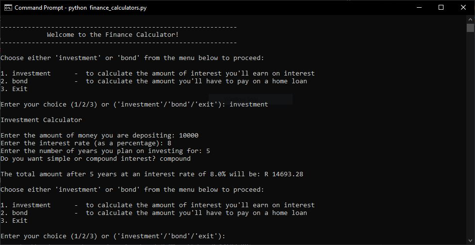
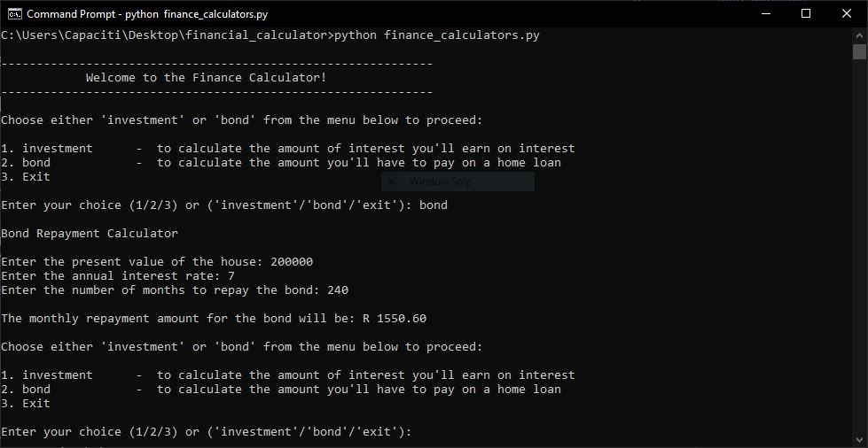

# Financial Calculator
 
 ## Overview
 This Python program provides two financial calculators: an investment calculator and a home loan repayment calculator. It allows users to input various financial parameters to calculate either the returns on an investment or the monthly repayment amount for a home loan (bond).

 ## Setup
 1. Clone the repository or download the finance_calculators.py file.
 2. Ensure you have Python installed on your system (version 3.7 or higher recommended).
 3. Navigate to the directory containing finance_calculators.py.
   
 ## Getting Started
 To use the Finance Calculator application, follow these steps:

 1. Run the finance_calculators.py file using Python.  
      ```python finance_calculators.py```
 2. Upon running the program, you will be presented with a menu where you can choose between two calculators:

    • Investment Calculator: Calculates the total amount after investing a principal sum for a specified number of years with a given interest rate.  
    • Bond Repayment Calculator: Calculates the monthly repayment amount for a home loan based on the present value of the house, annual interest rate, and number of months to repay.
 3. Enter your choice by typing 1 or investment for the Investment Calculator, and 2 or bond for the Bond Repayment Calculator.
 4. Follow the prompts to input the required details. The program handles inputs gracefully and provides clear error messages for invalid inputs.

 ## Usage Examples
 ### Example 1: Investment Calculator
 Calculate the returns on an investment:  

  • Input:

    • Principal amount: 10000
    • Interest rate (as a percentage): 8
    • Number of years: 5
    • Type of interest (simple or compound): compound 

 • Output:  
    ```The total amount after 5 years at an interest rate of 8.0% will be: R 14693.28```



 ### Example 2: Bond Repayment Calculator
 Calculate the monthly repayment amount for a home loan:

 • Input:

    • Present value of the house: 200000
    • Annual interest rate: 7
    • Number of months to repay: 240

• Output:  
  ```The monthly repayment amount for the bond will be: R 1550.60```



## Notes
• The program uses Python's math module for mathematical calculations.  
• Ensure all inputs are numeric and within reasonable ranges to avoid errors.  
• If you encounter any issues or have questions, feel free to reach out to the program maintainer.